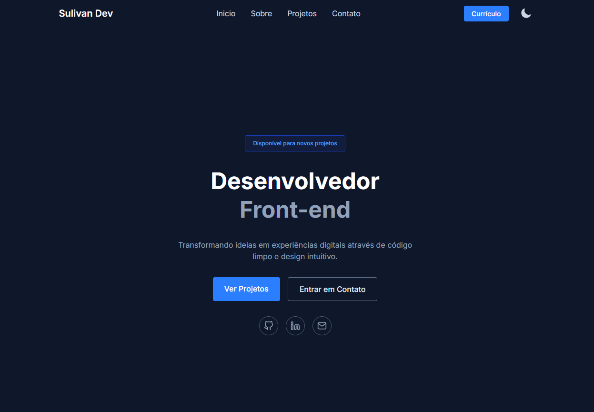

<h1 align="center">Sulivan Dev</h1>

<p align="center">
  Portfólio pessoal desenvolvido com React, TypeScript e Tailwind CSS.<br />
  Construído com foco em performance, acessibilidade e design responsivo.
</p>

<p align="center">
  <a href="#-preview">Preview</a> •
  <a href="#-tecnologias">Tecnologias</a> •
  <a href="#-funcionalidades">Funcionalidades</a> •
  <a href="#-como-rodar">Como rodar</a> •
  <a href="#-estrutura">Estrutura</a> •
  <a href="#-contato">Contato</a>
</p>

<p align="center">
  
</p>

🔗 **Acesse online:** ([https:profile-dev-inky.vercel.app](https://profile-dev-inky.vercel.app/))

---

## 🚀 Tecnologias

Este projeto foi desenvolvido com as seguintes tecnologias:

- **[React](https://react.dev/)** — Biblioteca para construção da interface
- **[TypeScript](https://www.typescriptlang.org/)** — Tipagem estática para mais segurança
- **[Vite](https://vitejs.dev/)** — Build tool moderna e rápida
- **[Tailwind CSS](https://tailwindcss.com/)** — Estilização utility-first
- **[React Router](https://reactrouter.com/)** — Roteamento de páginas
- **[React Icons](https://react-icons.github.io/react-icons/)** — Biblioteca de ícones

---

## ✨ Funcionalidades

- 🌗 **Tema claro e escuro** — Alterna entre os modos com persistência via `localStorage`
- 📱 **Totalmente responsivo** — Layout adaptado para mobile, tablet e desktop
- 📂 **Listagem de projetos** — Página dedicada para visualizar todos os projetos
- 📄 **Download do currículo** — Acesso rápido ao currículo em PDF
- ⚡ **Performance otimizada** — Build leve com Vite

---

## 🛠️ Como rodar

Antes de começar, você vai precisar ter instalado em sua máquina o [Node.js](https://nodejs.org/) e o [Git](https://git-scm.com/).

```bash
# Clone o repositório
git clone https://github.com/Sulivan7/profile-dev.git

# Entre na pasta do projeto
cd profile-dev

# Instale as dependências
npm install

# Inicie o servidor de desenvolvimento
npm run dev
```

Acesse [http://localhost:5173](http://localhost:5173) no seu navegador.

---

## 📁 Estrutura

```bash
src/
├── assets/
├── components/
├── data/
├── hooks/
├── pages/
├── sections/
├── types/
├── App.tsx
└── main.tsx
```

---

## 📬 Contato

Desenvolvido por **Sulivan Prenholato**

[](https://www.linkedin.com/in/sulivan-prenholato-b18667328/)
[](mailto:devsulivan@gmail.com)
[](https://github.com/Sulivan7)

---
